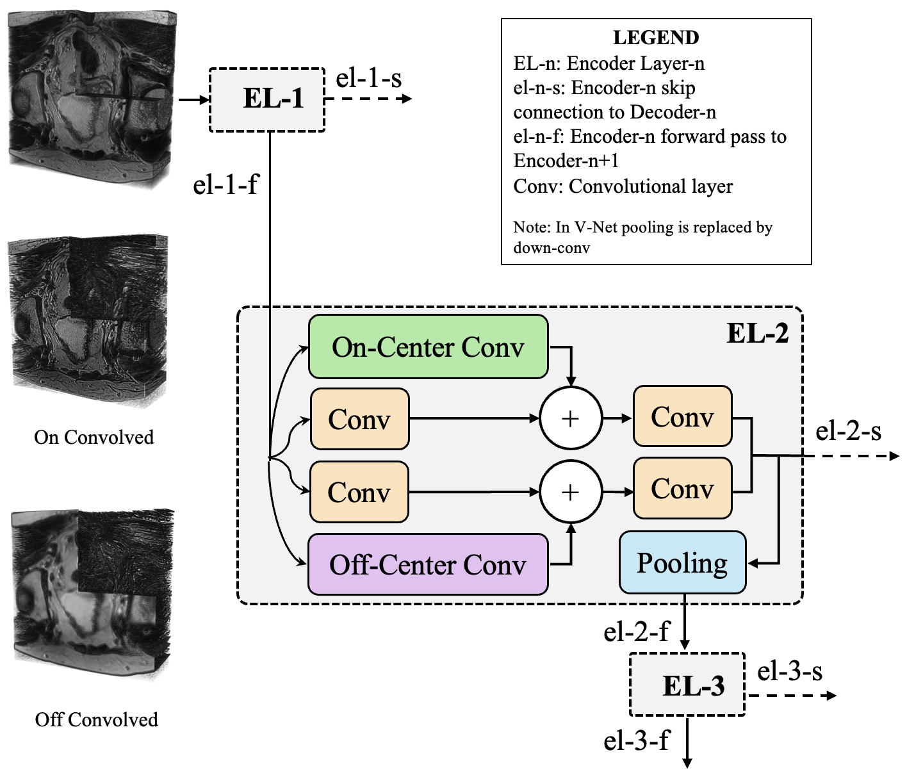
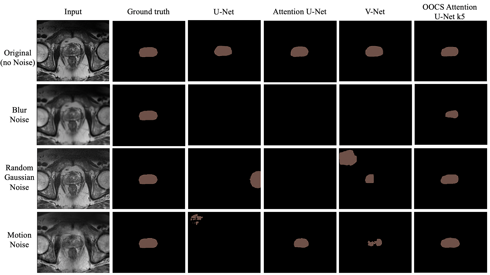

Latest version is available at the [IB_U_Nets](https://github.com/Shrajan/IB_U_Nets) respository. This is not maintained anymore.

# 3D-OOCS: LEARNING PROSTATE SEGMENTATION WITH INDUCTIVE BIAS
We created novel segmentation networks with 3D-OOCS on top of benchmark U-Net models. To provide an objective comparison between the established CNNs and ours, we created a pipeline that was used for training and testing all models. The repository consists of deep learning models that perform semantic segmentation of the prostate from MR images.

<p align="center">
  
</p>

We use the following metrics to evalute the performance of the models (however, the paper uses only the first two metrics):
1. [Sørensen Dice Coefficient](https://en.wikipedia.org/wiki/Sørensen–Dice_coefficient) - DSC
2. [Hausdorff Distance](https://en.wikipedia.org/wiki/Hausdorff_distance) - HSD
3. [Adjusted Rand Index](https://en.wikipedia.org/wiki/Rand_index) - ARI
4. [Interclass Correlation](https://en.wikipedia.org/wiki/Intraclass_correlation) - ICC

## 1. Project Directory ##

### 1.1. Helper Scripts ###
  * [dataloader.py](dataloader.py) - contains data generator. 
  * [models.py](models.py) - fetches required model from the list of networks.
  * [options.py](options.py) - contains default arguments.  
  * [utils.py](utils.py) - file saving, plotting graphs and predictions.

### 1.2. Models ###
The [networks](networks) sub-directory consists of the scripts for the following models:
1. U-Net - [3D U-Net: Learning Dense Volumetric Segmentation from Sparse Annotation.](https://arxiv.org/abs/1606.06650)
2. [OOCS U-Net](networks/oocs_unet.py) - On-center & Off-center surround (OOCS) pathways embedded in the U-Net. Two models exist based on the kernel size oocs_unet_k3 (k=3) and oocs_unet_k5 (k=5).
3. Attention U-Net - [Attention U-Net: Learning Where to Look for the Pancreas.](https://arxiv.org/abs/1804.03999)
4. [OOCS Attention U-Net](networks/oocs_attention_unet.py) - On-center & Off-center surround (OOCS) pathways embedded in the Attention U-Net. Two models exist based on the kernel size oocs_attention_unet_k3 (k=3) and oocs_attention_unet_k5 (k=5).
5. VNet - [V-Net: Fully Convolutional Neural Networks for Volumetric Medical Image Segmentation](https://arxiv.org/abs/1606.04797)
6. [OOCS V-Net](networks/oocs_vnet.py) - On-center & Off-center surround (OOCS) pathways embedded in the V-Net. Two models exist based on the kernel size oocs_vnet_k3 (k=3) and oocs_vnet_k5 (k=5).

### 1.3. Executable Scripts ###
* [downloadTask05_Prostate.sh](downloadTask05_Prostate.sh) - download the MRI dataset from the MSD website.
* [convertMSDprostate.py](convertMSDprostate.py) - resample the Task05Prostate MRI data to a different spacing.
* [hyperparam_optimization.py](hyperparam_optimization.py) - implementation of Hpbandster to retrieve best training parameters.
* [train.py](train.py) - training program.
* [test.py](test.py) - predicts the segmentation for the test dataset.
* [create_noisy_dataset.py](create_noisy_dataset.py) - generate noisy data with the test data to check robustness.

## 2. Usage ##
* Download/clone the repository.
* Navigate to the project directory. 
```
cd AAAI-2022-3DOOCS
```

### 2.1. Dependencies ###
* We trained and tested all our models on Ubuntu 18.04.
* It is recommended to create a virtual environment (preferably Conda) with python3 and above. We use [conda virtual environments](https://www.anaconda.com/distribution/#download-section) to run Python scripts. 
* Make sure to have the latest pip version. Run the following command to retrieve it:
```
pip install --upgrade pip
```

* The codes were written in **python3.8** with PyTorch (1.8.1) as the main package, along with other additional packages listed in the [Requirements.txt](Requirements.txt) file. These packages can be installed by running the command: 
```
python -m pip install -r Requirements.txt
``` 
OR 
```
pip install -r Requirements.txt
```

### 2.2. Data Preparation, Generation and Augmentation ###
* The data should be stored in a folder where each input file and corresponding ground truth label is saved in a sub-folder (one folder for one patient).
* The input CT/MRI and ground truth files should be named `data.nrrd` and `label.nrrd` respectively. The required structure of the data folder is shown below: 
```
    data/
    ├── train_and_test/
    │   └── 1/
    │       ├── data.nrrd
    │       ├── label.nrrd
    │   └── 2/
    │       ├── data.nrrd
    │       ├── label.nrrd
    |       ...
``` 
* When the sample size is small, like in the case of [Medical Segmentation Decathlon - Prostate Segmentation](http://medicaldecathlon.com/#tasks) dataset, it is better to perform cross-validation such as k-fold. The framework performs 5-fold validation.

* In such scenarios, the [dataloader.py](dataloader.py) will handle the train-test split based on the `fold` options. 
* We give you two options for the data, either 
    1. use our converted and structured data, or
    2. create from scratch.
* Converted and Structed Data:
    * This allows you to get the structured and converted data with voxel spacing (0.6, 0.6, 0.6) using the following command.
    ```
    source downloadTask05_Prostate.sh
    ```
* Create from scratch
    * Download the MSD - Prostate Segmentation dataset and extract it.
    * Use [convertMSDprostate.py](data_conversion/convertMSDprostate.py) script to convert the data samples into the recommended format. 
    * Conversion Instance: 
    ```
    python convertMSDprostate.py ----in_folder Task05_Prostate --out_folder data/train_and_test --change_spacing --new_spacing 0.6, 0.6, 0.6
    ```  
* The [dataloader.py](dataloader.py) reads the MR images, performs augmentation using [utils.py](utils.py) and supplies `n_batches` of data during training.

### 2.3. Arguments (Options) ###
* The pipeline provides several arguments to choose from, that can be found in [options.py](options.py) file. Nonetheless, we have listed a few important options to consider if you are new to this.
* Important arguments/options that have for both hyperparameter search and training:
```
[--dataset_contains DATASET_CONTAINS]      Mention what the type of data samples. The choices are (train_and_test, train). [Default: train_and_test]
[--img_mod IMG_MOD]                        The modality of the data samples: Choices = [CT, MR]. [Default: MR]
[--patch_shape PATCH_SHAPE]                The voxel shape (height, width, depth) of the data patch. [Default: (160,160,64)]
[--input_channels INPUT_CHANNELS]          The number of channels in the input data. [Default: 1]
[--output_channels OUTPUT_CHANNELS]        The number of channels in the ground truth labels. [Default: 1]
[--n_batches N_BATCHES]                    The number of samples per mini-batch. [Default: 2]
[--n_kernels N_KERNELS]                    The number of kernels/filters in the first layer that doubles every layer forward. [Default: 32]
[--p_foreground P_FOREGROUND]              The percentage of random CT/MRI patches (corresponding ground truth is empty) sampled per batch. [Default: 0.6]
[--results_path RESULTS_PATH]              The location to save the results of the current experiment. [Default: results/train/]  
[--data_root DATA_ROOT]                    The location of the training (and validation) samples. [Default: data/train/]
[--model_name MODEL_NAME]                  The model architecture for the experiment. Choices=[unet, oocs_unet_k3, oocs_unet_k5, attention_unet, oocs_attention_unet_k3, oocs_attention_unet_k5, vnet, oocs_vnet_k3, oocs_vnet_k5]. [Default: unet]
[--device_id DEVICE_ID]                    The ID of the GPU to be used. If no GPU, then CPU will be used. [Default: 0]
[--fold FOLD]                              Select the fold index for 5-fold crosss validation. This should be used when 'dataset_contains' options is 'train_and_train'. If fold == -1, then no cross-validation, but randomly splits dataset. Choices = [-1,0,1,2,3,4] Choice[Default: -1]
[--no_clip NO_CLIP]                        If this is not used, then the MRI data will be clipped to 5 and 95 percentiles.
```

### 2.4. Hyperparamter Search ###
* It is recommended to perform a hyperparameter search based on the training data and the chosen model to get the best and fair (objective) results. 
* Searching from scratch can be done using [hyperparam_optimization.py](hyperparam_optimization.py) script. 
* Currently, the script searches the best configuration for `beta1` (range: [0.1-0.9]), `dropout_rate` (range: [0.0-0.7]) and `dropout_rate` (range: [0.000001-0.1]). These can be changed as required by modifying their respective minimum and maximum option values.
* Additional arguments for hyperparameter search that could considered: 
```
[--max_budget MAX_BUDGET]       The maximum number of epochs to train the model for a given confiugration. [Default: 500]  
[--min_budget MIN_BUDGET]       The minimum number of epochs to train the model for a given confiugration. [Default: 100]  
```

#### 2.4.1. Search Instance ####
```
python hyperparam_optimization.py --data_root data/train_and_test --model_name unet --results_path results/hp_search/unet --max_budget 300 --min_budget 200 --fold 0 --no_clip --dataset_contains train_and_test
```

#### 2.4.2. Outputs ####
`results_path` location will contain the following files for every experiment.
* `training_options.txt` stores the options used for the search.
* `configs.json` contains a dictionary of the different hyperparameters values used in different experiments (runs).
* `results.json` contains a dictionary of the best results of different experiments.
* `overall_best_net.sausage` is saved when the model achieves the highest mean validation DSC of all the configurations. It contains the state_dict and a few other values. Please refer to [hyperparam_optimization.py](hyperparam_optimization.py) for the complete list.
* `config_N_detailed_history.csv` lists the corresponding epoch, iteration (no. of validation samples), loss and metrics (DSC, HSD, ARI, ICC) for every sample.. 'N' corresponds to the run count and the summary of this file can be found in 'N'th row of the `results.json` file.
* `config_N_history.csv` lists the corresponding epoch, mean validation loss and mean validation metrics for every epoch.

### 2.5. Model Training ###
* Training from scratch can be done using [train.py](train.py) script. 
* `Caution:` It is recommended that you complete `section 2.4` before starting training. 
* You could change the following arguments for training after hyperparameter search finds the best combination:
```
--lr LR]                                Learning rate for the optimizer. [Default: 0.0001] 
[--beta1 BETA1]                          Beta1 for Adam solver. [Default: 0.9] 
[--loss_fn LOSS_FN]                      The loss function to calculate the error. [Default: binary_cross_entropy]
[--dropout_rate DROPOUT_RATE]            The probability of dropping nodes in the layers. [Default: 0.5]
[--starting_epoch STARTING_EPOCH]        The last trained epoch of the saved point. This should be 0 if training is starting from scratch. [Default: 0]
[--training_epochs TRAINING_EPOCHS]      The number of epochs to train the model. [Default: 500]  
```
#### 2.5.1. Training Instance  ####
```
python train.py --data_root data/train_and_test --results_path results/training/unet/fold_0/ --device_id 0 --margin 2 --model_name unet --no_clip --fold 0 --beta1 0.49975392809845687 --dropout_rate 0.06662696925009508 --lr 0.00961050139856093 --dataset_contains train_and_test
```

#### 2.5.2. Outputs ####
`results_path` location will contain the following files for every experiment.
* `training_options.txt` stores the options used for the experiment.
* `training_iterations.csv` lists the corresponding epoch, iteration (no. of training samples/`n_batches`), loss and metrics (DSC, HSD, ARI, ICC) for every trained batch.
* `validation_iterations.csv` lists the corresponding epoch, iteration (no. of validation samples), loss and metrics (DSC, HSD, ARI, ICC) for every sample.
* `history.csv` lists the corresponding epoch, mean training loss, mean training metrics, mean validation loss and mean validation metrics for every epoch.
* `best_net.sausage` is saved when the model achieves the highest mean validation DSC for an epoch. It contains the state_dict and a few other values. Please refer to [train.py](train.py) for the complete list.
* `complete_model.pt` contains the entire model that is saved after the full training.
* `└──predictions` folder will be created if the option `save_freq > 0` and will contain predicted labels of all the validation samples for every nth epoch.

#### 2.5.3. Further training ####
* Additional arguments for `train.py` that could considered to resume train or transfer learning: 
```
[--resume_train RESUME_TRAIN]            Continue training from the last saved point. [Default: False] 
[--starting_epoch STARTING_EPOCH]        This should only be changed if --resume_train is True. The value should be equal to the final epoch of previous training.
[--training_epochs TRAINING_EPOCHS]      The number of epochs to train the model. [Default: 500]  
[--results_path RESULTS_PATH]            The location to first retrieve the results of the previous experiment, and then also store the output of the current run . [Default: results/train/]  
```
`Note:` Resuming training or transfer learning takes results (model files, csv files) from the folder of the previous run and modifies them. It is recommended to keep a separate copy of the original run. Also `total epochs for further training = training_epochs - starting_epochs`

### 2.6. Model Testing ###
* Predicting the segmentation results for the test data [test.py](test.py) script. 
* By providing the location of the test dataset, the previously trained model with its name, segmentation predictions and metrics are calcualed and saved.
```
[--results_path RESULTS_PATH]              The location to save the results of the predictions. [Default: results/test/]  
[--data_root DATA_ROOT]                    The location of the test samples. [Default: data/test/]
[--dataset_contains DATASET_CONTAINS]      Mention what the type of data samples. The choices are (train_and_test, test). [Default: train_and_test]
[--trained_model_path TRAINED_MODEL_PATH]  The location of the best_net.sausage file of the particular model to be tested. 
[--divisor DIVISOR]                      Patch overlap for sliding window. Overlap is 1/divisor. More = slower computation time, less = worse performance (more or less). [Default: 2]
[--fold FOLD]                            Select the fold index for 5-fold crosss validation. This should match the fold option of the training experiment. [Default: -1]
```

#### 2.6.1. Testing Instance  ####
```
python test.py --data_root data/train_and_test --model_name unet --trained_model_path results/training/unet/fold_0/best_net.sausage --results_path results/testing/unet/fold_0 --divisor 3 --dataset_contains train_and_test --fold 0
```

#### 2.6.2. Outputs ####
`results_path` location will contain the following files for every experiment.
* `test_options.txt` stores the options used for the experiment.
* `results.csv` saves the statistical values: mean, median, standard deviation, minimum and maximum for the metrics (DSC, HSD, ARI, ICC) of all the samples.
* `results_detailed.csv` saves the metrics (DSC, HSD, ARI, ICC) for every single sample.
* `└──predictions` folder will contain predicted labels of all the test samples.

#### 2.6.3. Robustness Evaluation  ####
* Use the file [create_noisy_dataset.py](create_noisy_dataset.py) to add artifacts to the 3D MRI volumes. The three types of artifacts are:
    * Random Gaussian Noise - std values we used for our experiments = [30, 45, 60]
    * Gaussian Blur Noise - std values we used for our experiments = [2, 3, 3.5]
    * Motion Artifacts - # transforms we used for our experiments = [5, 8, 10]
* We added artifacts to all the volumes in the dataset since we used cross-validation. Use the following arguments to generate a noisy dataset.
```
[--data_root DATA_ROOT]                       Directory of the samples created in Section 2.2. [Default: train_and_test]
[--results_path RESULTS_PATH]                 Folder to store the new samples with artifacts. [noisy_data]
[--noise NOISE]                               Select the type of noise to add. Choices = [random, motion, blur]. [Default: random]
[--blur_std BLUR_STD]                         The amount of standard deviation to be applied to create blur noise. [Default: 2]
[--random_std RANDOM_STD]                     The amount of standard deviation to be applied to create random Gaussian noise. [Default: 30]
[--motion_transforms MOTION_TRANSFORMS]       The number of transforms to be applied to create motion noise. [Default: 5]
```
* Instance of creating a dataset with blurring noise:
```
python create_noisy_dataset.py --data_root data/train_and_test --results_path data/noisy_blur_data --noise blur --random_std 2
```
* Robustness evaluation uses the [test.py](test.py) and the same procedure described in section 2.6.1. The only change is the path of `--data_root` as shown below:
```
python test.py --data_root data/noisy_blur_data --model_name unet --trained_model_path results/training/unet/fold_0/best_net.sausage --results_path results/testing/unet/fold_0 --divisor 3 --dataset_contains train_and_test --fold 0
```

## 3. Results ##
|  U-Net Model         | DSC  | HSD(mm)|
| -------------------- | -----|--------|
| U-Net | 0.744 +/- 0.24 | 33.777 +/- 37.81 |
| OOCS U-Net (k3) | 0.798 +/- 0.11 | 24.518 +/- 12.46 |
| OOCS U-Net (k5) | 0.824 +/- 0.07 | 24.474 +/- 12.48 |
| Attention U-Net | 0.824 +/- 0.09 | 27.822 +/- 14.64 |
| OOCS Attention U-Net (k3) | 0.845 +/- 0.07 | 24.106 +/- 14.70 |
| OOCS Attention U-Net (k5) | 0.835 +/- 0.11 | 23.531 +/- 14.89 |
| V-Net | 0.792 +/- 0.16 | 25.170 +/- 22.91 |
| OOCS V-Net (k3) | 0.791 +/- 0.13 | 26.488 +/- 17.68 |
| OOCS V-Net (k5) | 0.825 +/- 0.08 | 21.471 +/- 10.01 |


<p align="center">
  
</p>
